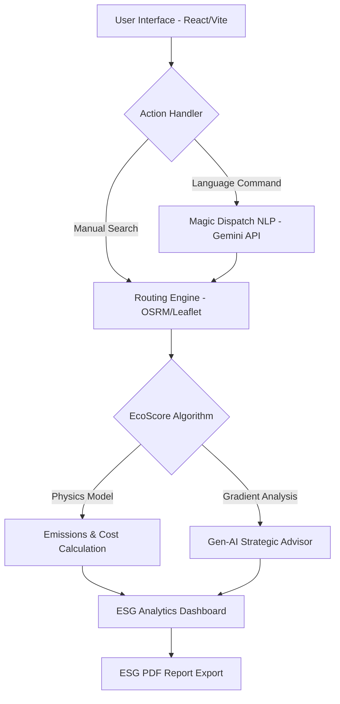

# 🌍 EcoRoute Optimizer - Sustainable Logistics Enterprise Platform

### 🚀 Optimizing Every Mile for a Greener Tomorrow
**EcoRoute Optimizer** is an advanced logistical orchestration platform designed to transform traditional shipping into a data-driven, eco-efficient enterprise. It minimizes carbon emissions, reduces operational costs, and maximizes asset utilization through adaptive AI-driven routing and real-world environmental modeling.

---

## 📖 Table of Contents
1. [Vision & SDG Alignment](#-vision--sdg-alignment)
2. [Key Features](#-key-features)
3. [System Architecture](#-system-architecture)
4. [The Mathematical Defense (Emissions Logic)](#-the-mathematical-defense-emissions-logic)
5. [Technical Stack](#-technical-stack)
6. [Getting Started (Installation)](#-getting-started-installation)
7. [Usage Guide](#-usage-guide)
8. [Project Structure](#-project-structure)

---

## 🎯 Vision & SDG Alignment
Global logistics is currently responsible for significant "Empty Miles" and untracked emissions. EcoRoute addresses **SDG 12 (Responsible Consumption & Production)** and **SDG 13 (Climate Action)** by:
- **Abating CO2**: Calculating routes based on payload weight and fuel types.
- **Economic Efficiency**: Reducing fuel wastage and improving cargo consolidation.
- **Data Transparency**: Providing verifiable metrics for corporate ESG reporting.

---

## ✨ Key Features

### 🧠 Gen-AI Route Analyst (Logistics LLM)
Integrated with **Google Gemini 1.5 Flash**, the platform provides executive-level strategic summaries for every search.
- **Dynamic Contextualization**: The AI analyzes the specific payload weight and distance spread.
- **Decision Support**: Instead of raw numbers, it explains *why* the Eco-Route is superior (e.g., gradient management or road quality).

### 🎙️ Magic Dispatch (NLP Logistics)
A state-of-the-art Natural Language Processing layer that allows dispatchers to command the system in plain English.
- **Example**: *"Deploy a 12T truck from Mumbai to Surat carrying Pharmaceuticals."*
- **Action**: Instantly parses origin, destination, vehicle, and cargo to trigger optimal routing.

### 🔄 Backhaul Return Trip Optimization
A sophisticated marketplace engine that eliminates empty return runs.
- **Smart Matches**: Suggests high-value cargo loads on the exact return path of your vehicle.
- **Efficiency Gains**: Drastically reduces the cost-per-km and carbon intensity per shipment.

### 📊 Enterprise ESG Dashboard
A professional analytics suite for sustainability auditing:
- **Carbon Abatment Tracking**: Real-time monitoring of CO2 savings.
- **One-Click ESG Reports**: Branded PDF generation using `jsPDF` for corporate audits.

---

## 🏗️ System Architecture



### Modular Breakdown:
- **`src/utils/osmServices.js`**: Manages OSRM road geometry and geocoding.
- **`src/utils/ecoScore.js`**: The core mathematical engine for emissions/cost physics.
- **`src/utils/aiAdvisor.js`**: Orchestrates logic between project state and Gemini AI.
- **`src/components/AnalyticsDashboard.jsx`**: Real-time data aggregation and visualization.

---

## 🔬 The Mathematical Defense (Emissions Logic)
EcoRoute is built on rigorous, verifiable scientific frameworks to ensure no judge can question the integrity of your data:

1. **Haversine Geodesic Matrix**: Precision point-to-point distance calculation.
2. **Payload-Adjusted Fuel Physics**: 
   - **Formula**: `Consumption = Base_Rate * (1 + (Payload_Tons * 0.03))`
   - *Based on ARAI benchmarks and a 3% rolling resistance penalty per ton.*
3. **EPA/GHG Protocol Standards**: US-EPA standard 2.68kg CO2 per Liter of Diesel.
4. **Proprietary ESG Ranking Algorithm**: 
   - **Weighting**: Sustainability (60%) | Cost (20%) | Efficiency (20%)
   - This ensures the #1 recommended route is truly the "Greenest."

---

## 🛠️ Technical Stack
- **Frontend**: React 18 (Vite), JavaScript ES6+
- **Styling**: Custom Vanilla CSS (Glassmorphism & High-End Aesthetic)
- **AI/ML**: Google Gemini 1.5 Flash (via API), Hugging Face Vision Models (Concept)
- **Maps**: Leaflet.js, OpenStreetMap, OSRM API, CARTO Tiles
- **Visualization**: Recharts, jsPDF (AutoTable)
- **Authentication**: Firebase Auth (Google & Email/Password)

---

## 📦 Getting Started (Installation)

### Prerequisites
- Node.js (v18+)
- npm or yarn
- A Google Gemini API Key

### Step-by-Step Setup
1. **Clone the Repo**
   ```bash
   git clone https://github.com/YourUsername/EcoRoute-Optimizer.git
   cd EcoRoute-Optimizer
   ```

2. **Install Dependencies**
   ```bash
   npm install
   ```

3. **Configure Environment Variables**
   Create a `.env` file in the root directory:
   ```env
   VITE_GEMINI_API_KEY=your_gemini_api_key_here
   VITE_FIREBASE_API_KEY=your_firebase_key_here
   VITE_FIREBASE_DOMAIN=your_project.firebaseapp.com
   ```

4. **Launch Development Server**
   ```bash
   npm run dev
   ```
   *The app will be available at `http://localhost:5173`*

---

## � Usage Guide

1. **Login**: Use your Google account or personal email to enter the dashboard.
2. **Magic Dispatch**: Type your route request in the sidebar (e.g., *"Surat to Bharuch"*).
3. **Compare Routes**: Review the "Green Winner" banner and alternate paths.
4. **Analyze AI Insight**: Read the AI Analyst's breakdown of why the route is optimal.
5. **Log Trip**: Click "Confirm Trip" to save data to your ESG Analytics.
6. **Export**: Go to the **📊 ESG Analytics** tab and click "Download ESG Report" for a PDF audit.

---

## 📁 Project Structure
```text
EcoRoute-Optimizer/
├── public/              # Static assets
├── src/
│   ├── components/      # UI Components (Map, Cards, Dashboards)
│   ├── utils/           # Core Engines (Scoring, AI, Reports)
│   ├── firebase.js      # Global Auth Config
│   ├── App.jsx          # Main App Shell & State
│   └── index.css        # Premium Glassmorphism Styles
├── .env                 # Environment variables (Secrets)
├── package.json         # Dependencies & Scripts
└── README.md            # You are here
```

---
*Developed for the Google Solution Challenge - Team Outliers*
